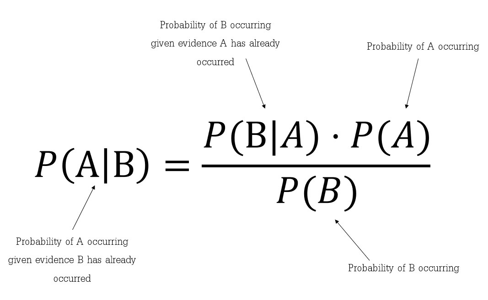
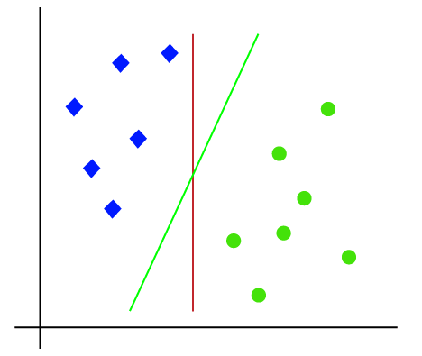
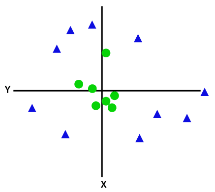

# Machine Learning Basics

To Practically implement and study the effect of different optimizers on hyperparamters
## Naive Bayes Classification
The fundamental Naive Bayes assumption is that each feature makes an:
1. independent
2. equal
contribution to the outcome.

It is importatnt to undertand [Bayes' Theorem](https://www.investopedia.com/terms/b/bayes-theorem.asp) to understand Naive Bayes.

### Bayes' Theorem
Bayes’ Theorem finds the probability of an event occurring given the probability of another event that has already occurred. Bayes’ theorem is stated mathematically as the following equation:



### Gaussian Naive Bayes Classifier
In Gaussian Naive Bayes, continuous values associated with each feature are assumed to be distributed according to a Gaussian distribution.

A practical implementation of Gaussian Naive Bayes on the Iris Dataset can be seen [here](gaussian_naive_bayes_iris.py).

To execute it :
```
$ python gaussian_naive_bayes_iris.py
```
## Support Vector Machine

Support vector machines (SVMs, also known as support vector networks) are one of the popular algorithm in the world of machine learning. SVM is a supervised alogorithm and can be used to regression and classification problems.
The goal of the SVM algorithm is to create the best line or decision boundary that can segregate n-dimensional space into classes so that we can easily put the new data point in the correct category in the future. This best decision boundary is called a hyperplane.

SVM chooses the extreme points/vectors that help in creating the hyperplane. These extreme cases are called as support vectors, and hence algorithm is termed as Support Vector Machine.Two lines are drawn passing through support vecotors and this two lines is called margin line.

There can be multiple hyperplane possible but we always choose that hyperplan who's margin distance is maximum because it will help us to generalise our model better.
<br>
Depending upon the data SVM can be of two types :

1. Linear Separable SVM

<br>

2. Non-Linear Seperable SVM

<br>

We solve Non-Linear Separable SVM by using non Linear SVC kernels. The basic task of SVC kernel is to increase the dimensionality of the model to create hyperplane.
Depending upon the feautures present in the data there can be N-Dimensional hyperplane where N stands for number of features present in the data.


## Decision Trees
Decision Trees are a type of Supervised Machine Learning where the data is continuously split according to a certain parameter. It is a tree-structured classifier, where internal nodes represent the features of a dataset, branches represent the decision rules and each leaf node represents the outcome.
Decision trees consists of two nodes: the Decision Node and the Leaf Node. Decision nodes are used to make any decision and have multiple branches, whereas Leaf nodes are the output of those decisions and do not contain any further branches. The decisions or the test are performed on the basis of features of the given dataset.

<br>
<sub><sup>StatQuest. “Decision and Classification Trees, Clearly Explained!!!” YouTube, Joshua Starmer, 26 Apr. 2021, https://youtu.be/_L39rN6gz7Y</sup></sub>

Decision trees can be subdivided into two types:
- <b>Classification Trees</b>: Maps the binary decision that lead to a diecison about the class of an object. It labels, records and assigns variables to descrete classes. Classification data is generally preferred for decision trees.

- <b>Regression Trees</b>: It is designed to approximate continous and real-valued functions. Makes use of binary recursive partioning, which is an  iterative process that splits the data into partitions or branches, and then continues splitting each partition into smaller groups as the method moves up each branch.

To predict the class of the given dataset, the algorithm starts from the root node of the tree. This algorithm compares the values of root attribute with the record (real dataset) attribute and, based on the comparison, follows the branch and jumps to the next node. For the next node, the algorithm again compares the attribute value with the other sub-nodes and move further. It continues the process until it reaches the leaf node of the tree.

Implementation of Decision trees on the Pima Indians Diabetes Dataset can be seen [here](decision-trees.ipynb).


## Required Libraries
```
$ pip install datascience
```
