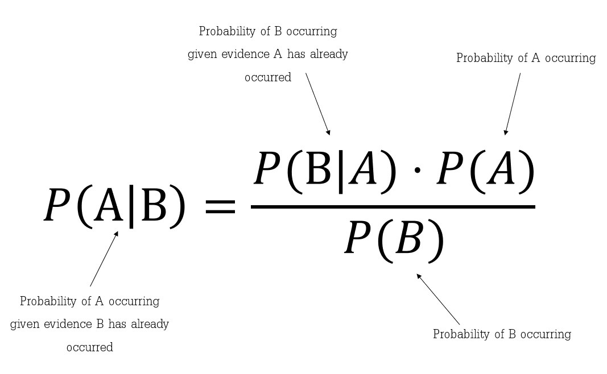

# Machine Learning Basics
To Practically implement and study the effect of different optimizers on hyperparamters
## Naive Bayes Classification
The fundamental Naive Bayes assumption is that each feature makes an:
1. independent
2. equal
contribution to the outcome.

It is importatnt to undertand [Bayes' Theorem](https://www.investopedia.com/terms/b/bayes-theorem.asp) to understand Naive Bayes.
### Bayes' Theorem
Bayes’ Theorem finds the probability of an event occurring given the probability of another event that has already occurred. Bayes’ theorem is stated mathematically as the following equation:

## Decision Trees
Pending
## Support Vector Machine
Pending
## Required Libraries
```
$ pip install datascience
```
